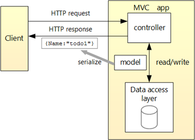

# Food Api
---
## Reason:

As we eat food we don't normally read the nutruition facts about the food or it is not possible to rectreive the information. There are also times you have these informations but there is not a way for you to relay these information swiftly.
This project is an api project using a connected MYSQL database.

---
## Changes:

Originally the endpoints vegan and glutenfree was referenced to the ingredient table but it was moved to the food table to accomadate with
getting accurate information for the food instead of the ingredient itself.
In the Ingredient table recording the serving size of the unit of the serving size was added to include more information used in the food.

---
## Requiements:

- [x]	Create a README.md file at the root of your repository. 
  - [x] Add any instructions or documentation that you want to share with others. 
    - [x]	What are the different endpoints that a client can use? 
    - [x] Sample request bodies, if applicable? 
    - [x]	Sample response body? (There should only be one, as this should be consistent. More information on this further below). 
- [x]	There must be at least 3 different API endpoints 
- [x]	3 different HTTP methods being implemented in your API. 
- [x]	Your API needs to follow the MVC (Model-View-Controller) software design pattern.
- 	Image for reference: 

 

- [x]	There must be at least one controller.
- [x]	Models should be organized together and in their own folder. 
- [x]	Your collection of models must also include a basic response model (named Response) that is consistently returned at the end of every request. 
- At minimum, this response model must contain these properties:
  - [x]	An integer called statusCode with the value set appropriately (https://docs.microsoft.com/en-us/dotnet/api/microsoft.aspnetcore.http.statuscodes?view=aspnetcore-6.0) in the controller logic, depending on whether or not the call to the API endpoint was successful. 
  - [x]	A string called statusDescription that tells the client if the call to the API endpoint was successful or not, and why.  
  - [x]	Lists of any applicable returned items as properties (only required if using a GET HTTP method at any point). Remember to use = new(). 

---
## Your database must have at least… 

- [x]	Two tables
- [x]	Two primary keys
- [x]	One foreign key
- [x]	One additional constraint on a column that is NOT used as a primary key or a foreign key 

---
## TODO:
 
Create a get request with a list with vegan being true. 
Create patch request to change a part of the data in the database.

---
## Grading Rubric: 

- API Idea Presentation – 15% 
- Three HTTP Methods – 15% 
- Three API Endpoints – 15% 
- API Design Follows MVC Architecture Pattern – 15% 
- Consistent Response Model – 15% 
- README – 5% 
- SQL Script – 20%
